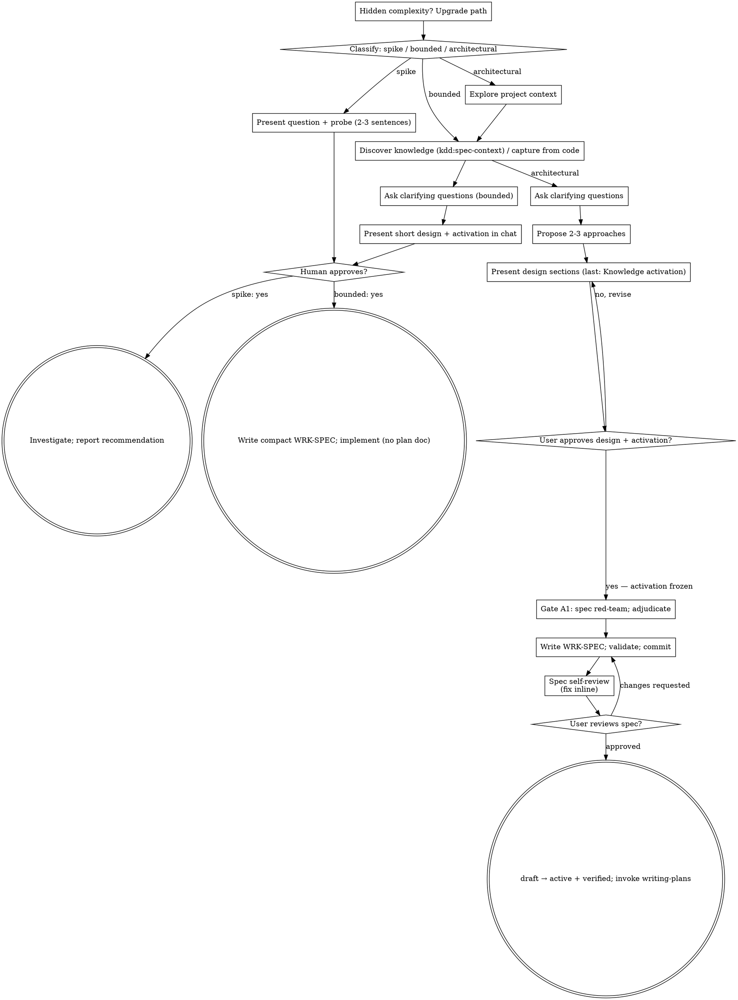

# Brainstorming Ideas Into Designs

Help turn ideas into fully formed designs and specs through natural collaborative dialogue.

Start by classifying how much process the request needs, then work
through your path: understand the context, refine the idea, present a
design, and get your human partner's approval.

<HARD-GATE>
Do NOT invoke any implementation skill, write any code, scaffold any
project, or take any implementation action until you have told your
human partner what you intend and they have approved it. This applies
to EVERY task on EVERY path below — the ceremony scales with the task;
the approval gate never does.
</HARD-GATE>

## Three Paths

Before your first question, classify the request and say the
classification out loud — "this looks bounded, so I'll present a short
design here rather than write a spec" — so your human partner can
override it:

- **Spike** — a feasibility question ("can we...", "is it possible...",
  "quick and dirty is fine") whose output is an answer, not code you
  keep. Present the question and what you'll try in 2-3 sentences, get
  a nod, then find out as cheaply as correctness allows. No design
  doc, no spec file. Report findings as a recommendation; anything you
  built stays labeled throwaway.
- **Bounded** — a well-scoped change to code that already exists in
  this repo: a new flag, a small endpoint, a one-file fix.
  Understanding the kind of app is not enough — bounded means the flow
  you are changing is already here to read. If there is no existing
  flow to change, the task is not bounded. Ask the clarifying
  questions that matter, present a short design IN CHAT (a few
  sentences to a few short paragraphs), and STOP.
  Implementation starts only after your human partner says yes to that
  design — a bounded task's approval is as hard a gate as an architectural
  one. Then write a **compact WRK-SPEC** (kdd-superpowers:kdd-conventions,
  *artifact-templates* → Compact WRK-SPEC): same frontmatter as the full
  one, body limited to Problem Statement, Proposed Change, Knowledge Context
  and Acceptance Criteria. No WRK-PLAN. The artifact exists because it is
  where the activation is frozen and what consolidation closes; what scales
  with simplicity is its size.
- **Architectural** — new projects, new subsystems, changes that
  restructure how components fit together or alter interfaces others
  depend on.
  Follow the full process: knowledge discovery, questions, approaches,
  sectioned design ending in *Knowledge activation*, gate A1, the WRK-SPEC,
  then the writing-plans skill.

When in doubt between two paths, take the heavier one. The ratchet is
one-way: hidden complexity discovered mid-task upgrades the path —
stop, say so, and step up. Nothing downgrades mid-task.

## Anti-Pattern: "Too Simple To Need Approval"

Every path ends with your human partner approving your intent before
implementation. A todo list, a single-function utility, a config
change — the design may be two sentences in chat, but you MUST present
it and get approval. "Simple" tasks are where unexamined assumptions
cause the most wasted work. What scales with simplicity is the
artifact, never the approval.

## Red Flags

| Thought | Reality |
|---------|---------|
| "This is too simple to need a design" | Simple means a short design, not no design. Two sentences in chat, then approval. |
| "I'll call it bounded and skip the spec" | Reaching for a label to skip work IS the doubt — take the heavier path. |
| "It's bounded and the design is obvious — I'll start while they read it" | The gate is the approval, not the design's length. Present, then stop until you hear yes. |
| "I understand this kind of app, so it's bounded" | Bounded measures the repo, not your familiarity. A new project has no existing flow — it is architectural. |
| "The spike works, so I'll keep the code" | A spike's output is an answer. Keeping the code is a new request — classify it. |
| "It grew, but I'm almost done — no need to re-classify" | Hidden complexity upgrades the path mid-task. Stop and say so. |
| "They approved the spike, so the follow-up change is approved too" | Each task gets its own classification and its own approval. |

## Checklist

Classify first, announce the path, then create a task for each item on
your path and complete them in order.

**Spike:**
1. **Explore project context** — enough to frame the probe
2. **Present question + probe plan** — 2-3 sentences
3. **Get approval** — a nod is enough
4. **Investigate** — as cheaply as correctness allows
5. **Report findings** — a recommendation; label anything built as throwaway

**Bounded:**
1. **Explore project context** — check files, docs, recent commits; read the `<KDD-ENVIRONMENT>` block
2. **Discover knowledge** — `kdd:spec-context "<request>"` when `specs/` exists; capture from code when it does not cover what you will touch (see *Capturing from code* below)
3. **Ask clarifying questions** — one at a time, the ones that matter
4. **Present short design in chat** — approach, files touched, testing, and the activation (which specs, which pins, which FRAGs)
5. **Get approval** — STOP and wait for an explicit yes; presenting the design and starting in the same breath is skipping the gate
6. **Write the compact WRK-SPEC** — allocate the ID, write, validate, commit, transition to `active` with the human's `verified` (see *Writing the WRK-SPEC*)
7. **Implement** — proceed with the normal development workflow (TDD applies); no plan document

**Architectural:**
1. **Explore project context** — check files, docs, recent commits; read the `<KDD-ENVIRONMENT>` block
2. **Discover knowledge** — REQUIRED SUB-SKILL `kdd:spec-context "<request>"` when `specs/` exists: its brief lists candidate Knowledge and Agentic specs, trust notes, undistilled fragments and gaps
3. **Capture from code (brownfield)** — when the candidates do not cover what the work will touch and code exists, apply kdd-superpowers:kdd-conventions `references/capturing-from-code.md` and write the FRAGs *before* the WRK-SPEC so it can cite them; only what the work touches
4. **Offer the visual companion just-in-time** — NOT upfront (see the Visual Companion section)
5. **Ask clarifying questions** — one at a time; let the rules in candidate specs drive them ("DOM-RISK-VAR-001 requires a 250-day window — does this change touch it?")
6. **Propose 2-3 approaches** — with trade-offs, your recommendation, and which specs constrain each approach
7. **Present design** — in sections scaled to their complexity, approval after each; the last section is always **Knowledge activation**
8. **Gate A1 — spec red-team** — dispatch `spec-adversary-prompt.md` against the draft; adjudicate every BROKEN row, fix the draft
9. **Write the WRK-SPEC** — `specs/work/<ID>-<slug>.md` per kdd-superpowers:kdd-conventions; `spec-graph validate` with 0 errors; commit
10. **Spec self-review** — placeholders, contradictions, ambiguity, scope, *and* every Constraint cites an activated spec or a FRAG
11. **User reviews written spec** — on approval: `status: draft → active`, append the human's `verified`, commit
12. **Transition to implementation** — invoke kdd-superpowers:writing-plans

## Process Flow

**Terminal states are path-bound.** Architectural: the ONLY skill you
invoke after brainstorming is writing-plans — never frontend-design,
mcp-builder, or any other implementation skill. Bounded: after
approval, write the compact WRK-SPEC and proceed directly through the
normal development workflow; no plan document. Spike: the terminal
state is a reported recommendation.

## The Process

The subsections below serve the bounded and architectural paths (a
spike stops at "present the probe, get a nod"). Sections from
**Exploring approaches** onward are architectural-path depth — for
bounded work, context plus a few questions plus a short in-chat design
is the whole process.

**Understanding the idea:**

- Check out the current project state first (files, docs, recent commits)
- Read the `<KDD-ENVIRONMENT>` block. With `specs/`, run `kdd:spec-context "<the request in one line>"` before any question: the specs it surfaces are where your questions come from, and the ones you will activate. Without `specs/`, say so once and plan to capture from code.
- Before asking detailed questions, assess scope: if the request describes multiple independent subsystems (e.g., "build a platform with chat, file storage, billing, and analytics"), flag this immediately. Don't spend questions refining details of a project that needs to be decomposed first.
- If the project is too large for a single spec, help the user decompose into sub-projects: what are the independent pieces, how do they relate, what order should they be built? Then brainstorm the first sub-project through the normal design flow. Each sub-project gets its own spec → plan → implementation cycle.
- For appropriately-scoped projects, ask questions one at a time to refine the idea
- Prefer multiple choice questions when possible, but open-ended is fine too
- Only one question per message - if a topic needs more exploration, break it into multiple questions
- Focus on understanding: purpose, constraints, success criteria

**Capturing from code (brownfield):**

- When the discovered specs do not cover what the work will touch and there is code, the code is the knowledge. Follow kdd-superpowers:kdd-conventions `references/capturing-from-code.md` to the letter: anchored literals, Observed ≠ Inferred, absences with their commands, `frag-cite-check` before writing, `confidence: low`, no `verified`.
- Write each FRAG (`next-id FRAG-<AREA>-<CONCEPT>`) before the WRK-SPEC so the spec can cite it in `sources` and in *Knowledge Context* as evidence. FRAGs are never activated.
- Scope: only what this work touches. Capturing the whole module is the "big bang" anti-pattern the brownfield playbook forbids.

**Exploring approaches:**

- Propose 2-3 different approaches with trade-offs
- Present options conversationally with your recommendation and reasoning
- Lead with your recommended option and explain why
- YAGNI ruthlessly - remove unnecessary features from every approach and design

**Presenting the design:**

- Once you believe you understand what you're building, present the design
- Scale each section to its complexity: a few sentences if straightforward, up to 200-300 words if nuanced
- Ask after each section whether it looks right so far
- Cover: architecture, components, data flow, error handling, testing — and, **always last, Knowledge activation**: a table of `activates` / `equips` with `ID@version` pins and the role of each, the FRAGs cited as evidence, the gaps (knowledge that should exist and does not — future capture candidates), and the proposed semantic ID path (`WRK-SPEC-<AREA>-<CONCEPT>`, reusing areas the graph already has). **Approving this section freezes the activation**: nothing downstream reopens it; a task that needs more knowledge records a `Knowledge gap:` ruling instead.
- Be ready to go back and clarify if something doesn't make sense

**Design for isolation and clarity:**

- Break the system into smaller units that each have one clear purpose, communicate through well-defined interfaces, and can be understood and tested independently
- For each unit, you should be able to answer: what does it do, how do you use it, and what does it depend on?
- Can someone understand what a unit does without reading its internals? Can you change the internals without breaking consumers? If not, the boundaries need work.
- Smaller, well-bounded units are also easier for you to work with - you reason better about code you can hold in context at once, and your edits are more reliable when files are focused. When a file grows large, that's often a signal that it's doing too much.

**Working in existing codebases:**

- Explore the current structure before proposing changes. Follow existing patterns.
- Where existing code has problems that affect the work (e.g., a file that's grown too large, unclear boundaries, tangled responsibilities), include targeted improvements as part of the design - the way a good developer improves code they're working in.
- Don't propose unrelated refactoring. Stay focused on what serves the current goal.

**Gate A1 — spec red-team (architectural path):**

Before you write the WRK-SPEC file, dispatch the adversary in
[spec-adversary-prompt.md](spec-adversary-prompt.md) with the approved
design sections and the activated spec files. It returns an attack table
(kdd-superpowers:kdd-conventions `references/adversarial-gates.md`).
Adjudicate every `BROKEN` row out loud with your human partner — a broken
attack on an activated rule changes the design; a broken attack that
reveals missing knowledge becomes a gap in *Knowledge activation*. Then
write.

## Writing the WRK-SPEC

Both paths write one; the bounded path writes the compact form.

- REQUIRED SUB-SKILL: kdd-superpowers:kdd-conventions — IDs, template, trust family, validation.
- ID: `skills/kdd-conventions/scripts/next-id WRK-SPEC-<AREA>-<CONCEPT>` with the path your human partner confirmed. File: `specs/work/<ID>-<slug>.md` (create `specs/work/` if absent, and add `.kdd/` to `.gitignore` if absent).
- Frontmatter: `status: draft`, `confidence: low`, `version: 0.1.0`, pinned `activates`/`equips` exactly as approved, `activation_frozen: true`, `activation_resolved_at`, `dependencies` (`constrained-by` each activated spec, `implements` a target FEAT if any), `sources` (each FRAG with its directory), `generated`, `stale_after` (+90 days), `tags`.
- Body per the template: Problem Statement → Proposed Change (the approved sections as sub-headings) → Knowledge Context (the activation table; FRAGs marked "evidence, not activated") → Constraints (**verbatim** rules from activated specs with source ID and rule number; FRAG-observed behaviour with its anchor) → Acceptance Criteria (testable) → Open Questions.
- Validate: `<kdd-cli> --specs specs validate` — 0 errors, and no warning naming your artifact.
- Commit the WRK-SPEC (`spec(<ID>): <title>`).

**Spec Self-Review:**
After writing the WRK-SPEC, look at it with fresh eyes:

1. **Placeholder scan:** Any "TBD", "TODO", incomplete sections, or vague requirements? Fix them.
2. **Internal consistency:** Do any sections contradict each other? Does Proposed Change contradict a rule in Constraints?
3. **Scope check:** Is this focused enough for a single implementation plan, or does it need decomposition?
4. **Ambiguity check:** Could any requirement be interpreted two different ways? If so, pick one and make it explicit.
5. **Knowledge check:** Does every Constraint cite an activated spec or a FRAG? Is every activated spec used somewhere in the body? If a constraint has no source, it is your opinion — say so or drop it.

Fix any issues inline. No need to re-review — just fix and move on.

**User Review Gate:**
Ask your human partner to review the written spec before proceeding:

> "WRK-SPEC written, validated and committed to `<path>`. Please review it and let me know if you want to make any changes before we start writing out the implementation plan."

Wait for the response. If they request changes, make them, re-validate and re-run the self-review. Once they approve: set `status: active`, `updated: <today>`, append `verified: [{by: human:<id>, at: <now>}]` (ask for the id once if unknown — never invent it), re-validate (the confidence warning should disappear or be lifted with the human's say-so), commit (`spec(<ID>): approved — active, human-verified`).

**Implementation:**

- Architectural: invoke kdd-superpowers:writing-plans. Do NOT invoke any other skill.
- Bounded: proceed with the normal development workflow (TDD applies); the compact WRK-SPEC is the spec every reviewer reads.

## Visual Companion

A browser-based companion for showing mockups, diagrams, and visual options during brainstorming. Available as a tool — not a mode. Accepting the companion means it's available for questions that benefit from visual treatment; it does NOT mean every question goes through the browser.

**Offering the companion (just-in-time):** Do NOT offer it upfront. Wait until a question would genuinely be clearer shown than told — a real mockup / layout / diagram question, not merely a UI *topic*. The first time that happens, offer it then, as its own message:
> "This next part might be easier if I show you — I can put together mockups, diagrams, and comparisons in a browser tab as we go. It's still new and can be token-intensive. Want me to? I'll open it for you."

**This offer MUST be its own message.** Only the offer — no clarifying question, summary, or other content. Wait for the user's response. If they accept, start the server with `--open` so their browser opens to the first screen automatically. If they decline, continue text-only and don't offer again unless they raise it.

**Per-question decision:** Even after the user accepts, decide FOR EACH QUESTION whether to use the browser or the terminal. The test: **would the user understand this better by seeing it than reading it?**

- **Use the browser** for content that IS visual — mockups, wireframes, layout comparisons, architecture diagrams, side-by-side visual designs
- **Use the terminal** for content that is text — requirements questions, conceptual choices, tradeoff lists, A/B/C/D text options, scope decisions

A question about a UI topic is not automatically a visual question. "What does personality mean in this context?" is a conceptual question — use the terminal. "Which wizard layout works better?" is a visual question — use the browser.

If they agree to the companion, read the detailed guide before proceeding:
`skills/brainstorming/visual-companion.md`
