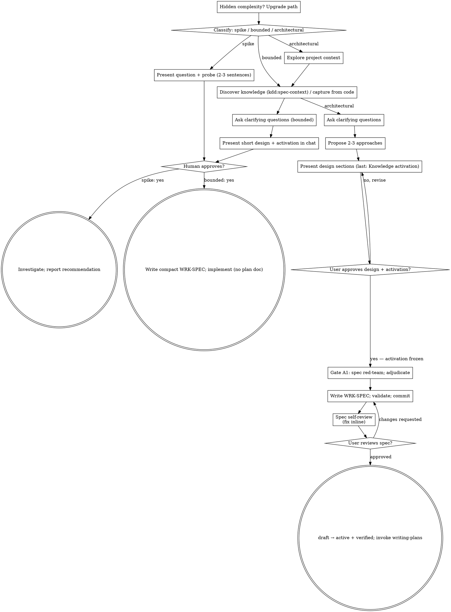

# WRK-TASK-FORK-CORE-001-011 — `brainstorming`: WRK-SPEC output, knowledge activation, gate A1, companion paths

## Objective

Make brainstorming produce a WRK-SPEC with frozen activation instead of
a design document (spec Skill 2; P1, P2, P3, P6, P11), add the *Knowledge
activation* design section and the A1 spec red-team gate, and strip the
upstream branding/telemetry from the visual companion (P13).

## Implementation Notes

**Files:**
- Modify: `skills/brainstorming/SKILL.md`, `skills/brainstorming/scripts/server.cjs`, `skills/brainstorming/scripts/frame-template.html`, `skills/brainstorming/scripts/start-server.sh`, `tests/brainstorm-server/branding.test.js`, `tests/scripts/test-skill-content.sh`
- Create: `skills/brainstorming/spec-adversary-prompt.md`
- Test: `tests/scripts/test-skill-content.sh`, `tests/brainstorm-server/` (`npm test` there)

**Interfaces:**
- Consumes: `kdd-superpowers:kdd-conventions` and its references (009); `next-id` (003); `frag-cite-check` (004); `kdd-cli` (002); toolkit skill `kdd:spec-context`.
- Produces: a WRK-SPEC at `specs/work/<ID>-<slug>.md` in `status: active` with `verified` by the human, which `writing-plans` (012) requires as input; the A1 prompt file the adversarial-gates reference names.

- [ ] **Step 1: Add the structural assertions (failing)**

Append under the marker in `tests/scripts/test-skill-content.sh`:

```bash
# --- brainstorming (Task 011) ---
must_contain skills/brainstorming/SKILL.md "kdd:spec-context" "brainstorming discovers via spec-context"
must_contain skills/brainstorming/SKILL.md "compact WRK-SPEC" "bounded path writes a compact WRK-SPEC"
must_contain skills/brainstorming/SKILL.md "Knowledge activation" "knowledge activation design section"
must_contain skills/brainstorming/SKILL.md "activation_frozen: true" "activation is frozen"
must_contain skills/brainstorming/SKILL.md "spec-adversary-prompt.md" "gate A1 wired"
must_contain skills/brainstorming/SKILL.md "capturing-from-code.md" "brownfield capture wired"
must_contain skills/brainstorming/SKILL.md "verified:" "records human verification on approval"
must_contain skills/brainstorming/SKILL.md "draft → active" "status transition on approval"
must_not_contain skills/brainstorming/SKILL.md "docs/" "no docs/ paths left"
must_contain skills/brainstorming/spec-adversary-prompt.md "| Attack | Scenario | Result | Evidence |" "A1 prompt uses the attack table"
must_not_contain skills/brainstorming/scripts/server.cjs "primeradiant" "companion has no upstream brand URL"
must_not_contain skills/brainstorming/scripts/server.cjs "TELEMETRY" "companion has no telemetry switch"
must_contain skills/brainstorming/scripts/frame-template.html "<title>kdd-superpowers Brainstorming</title>" "companion title renamed"
```

Run: `bash tests/scripts/test-skill-content.sh` — Expected: the new lines FAIL.

- [ ] **Step 2: Edit `skills/brainstorming/SKILL.md` — paths and outputs**

(a) In **Three Paths**, replace the *Bounded* bullet's last two sentences
(`Implementation starts only after … No spec file, no implementation plan document.`) with:

```markdown
  Implementation starts only after your human partner says yes to that
  design — a bounded task's approval is as hard a gate as an architectural
  one. Then write a **compact WRK-SPEC** (kdd-superpowers:kdd-conventions,
  *artifact-templates* → Compact WRK-SPEC): same frontmatter as the full
  one, body limited to Problem Statement, Proposed Change, Knowledge Context
  and Acceptance Criteria. No WRK-PLAN. The artifact exists because it is
  where the activation is frozen and what consolidation closes; what scales
  with simplicity is its size.
```

and the *Architectural* bullet's last sentence with:

```markdown
  Follow the full process: knowledge discovery, questions, approaches,
  sectioned design ending in *Knowledge activation*, gate A1, the WRK-SPEC,
  then the writing-plans skill.
```

(b) In **Checklist → Bounded**, replace items 1–5 with:

```markdown
1. **Explore project context** — check files, docs, recent commits; read the `<KDD-ENVIRONMENT>` block
2. **Discover knowledge** — `kdd:spec-context "<request>"` when `specs/` exists; capture from code when it does not cover what you will touch (see *Capturing from code* below)
3. **Ask clarifying questions** — one at a time, the ones that matter
4. **Present short design in chat** — approach, files touched, testing, and the activation (which specs, which pins, which FRAGs)
5. **Get approval** — STOP and wait for an explicit yes; presenting the design and starting in the same breath is skipping the gate
6. **Write the compact WRK-SPEC** — allocate the ID, write, validate, commit, transition to `active` with the human's `verified` (see *Writing the WRK-SPEC*)
7. **Implement** — proceed with the normal development workflow (TDD applies); no plan document
```

and **Checklist → Architectural** items 1–9 with:

```markdown
1. **Explore project context** — check files, docs, recent commits; read the `<KDD-ENVIRONMENT>` block
2. **Discover knowledge** — REQUIRED SUB-SKILL `kdd:spec-context "<request>"` when `specs/` exists: its brief lists candidate Knowledge and Agentic specs, trust notes, undistilled fragments and gaps
3. **Capture from code (brownfield)** — when the candidates do not cover what the work will touch and code exists, apply kdd-superpowers:kdd-conventions `references/capturing-from-code.md` and write the FRAGs *before* the WRK-SPEC so it can cite them; only what the work touches
4. **Offer the visual companion just-in-time** — NOT upfront (see the Visual Companion section)
5. **Ask clarifying questions** — one at a time; let the rules in candidate specs drive them ("DOM-RISK-VAR-001 requires a 250-day window — does this change touch it?")
6. **Propose 2-3 approaches** — with trade-offs, your recommendation, and which specs constrain each approach
7. **Present design** — in sections scaled to their complexity, approval after each; the last section is always **Knowledge activation**
8. **Gate A1 — spec red-team** — dispatch `spec-adversary-prompt.md` against the draft; adjudicate every BROKEN row, fix the draft
9. **Write the WRK-SPEC** — `specs/work/<ID>-<slug>.md` per kdd-superpowers:kdd-conventions; `spec-graph validate` with 0 errors; commit
10. **Spec self-review** — placeholders, contradictions, ambiguity, scope, *and* every Constraint cites an activated spec or a FRAG
11. **User reviews written spec** — on approval: `status: draft → active`, append the human's `verified`, commit
12. **Transition to implementation** — invoke kdd-superpowers:writing-plans
```

(c) Replace the whole `## Process Flow` dot graph with:



(d) In the paragraph after the graph (`**Terminal states are path-bound.**`), replace `Bounded: after approval, implementation proceeds directly …` with `Bounded: after approval, write the compact WRK-SPEC and proceed directly through the normal development workflow; no plan document.`

- [ ] **Step 3: Edit `skills/brainstorming/SKILL.md` — the process sections**

(a) In **The Process → Understanding the idea**, add as the second bullet:

```markdown
- Read the `<KDD-ENVIRONMENT>` block. With `specs/`, run `kdd:spec-context "<the request in one line>"` before any question: the specs it surfaces are where your questions come from, and the ones you will activate. Without `specs/`, say so once and plan to capture from code.
```

(b) Add a new subsection after **Understanding the idea** and before **Exploring approaches**:

```markdown
**Capturing from code (brownfield):**

- When the discovered specs do not cover what the work will touch and there is code, the code is the knowledge. Follow kdd-superpowers:kdd-conventions `references/capturing-from-code.md` to the letter: anchored literals, Observed ≠ Inferred, absences with their commands, `frag-cite-check` before writing, `confidence: low`, no `verified`.
- Write each FRAG (`next-id FRAG-<AREA>-<CONCEPT>`) before the WRK-SPEC so the spec can cite it in `sources` and in *Knowledge Context* as evidence. FRAGs are never activated.
- Scope: only what this work touches. Capturing the whole module is the "big bang" anti-pattern the brownfield playbook forbids.
```

(c) In **Presenting the design**, replace `- Cover: architecture, components, data flow, error handling, testing` with:

```markdown
- Cover: architecture, components, data flow, error handling, testing — and, **always last, Knowledge activation**: a table of `activates` / `equips` with `ID@version` pins and the role of each, the FRAGs cited as evidence, the gaps (knowledge that should exist and does not — future capture candidates), and the proposed semantic ID path (`WRK-SPEC-<AREA>-<CONCEPT>`, reusing areas the graph already has). **Approving this section freezes the activation**: nothing downstream reopens it; a task that needs more knowledge records a `Knowledge gap:` ruling instead.
```

(d) Add after **Working in existing codebases** (end of *The Process*):

```markdown
**Gate A1 — spec red-team (architectural path):**

Before you write the WRK-SPEC file, dispatch the adversary in
[spec-adversary-prompt.md](spec-adversary-prompt.md) with the approved
design sections and the activated spec files. It returns an attack table
(kdd-superpowers:kdd-conventions `references/adversarial-gates.md`).
Adjudicate every `BROKEN` row out loud with your human partner — a broken
attack on an activated rule changes the design; a broken attack that
reveals missing knowledge becomes a gap in *Knowledge activation*. Then
write.
```

- [ ] **Step 4: Replace `## After the Design (architectural path)`**

Replace everything from `## After the Design (architectural path)` up to (not including) `## Visual Companion` with:

```markdown
## Writing the WRK-SPEC

Both paths write one; the bounded path writes the compact form.

- REQUIRED SUB-SKILL: kdd-superpowers:kdd-conventions — IDs, template, trust family, validation.
- ID: `skills/kdd-conventions/scripts/next-id WRK-SPEC-<AREA>-<CONCEPT>` with the path your human partner confirmed. File: `specs/work/<ID>-<slug>.md` (create `specs/work/` if absent, and add `.kdd/` to `.gitignore` if absent).
- Frontmatter: `status: draft`, `confidence: low`, `version: 0.1.0`, pinned `activates`/`equips` exactly as approved, `activation_frozen: true`, `activation_resolved_at`, `dependencies` (`constrained-by` each activated spec, `implements` a target FEAT if any), `sources` (each FRAG with its directory), `generated`, `stale_after` (+90 days), `tags`.
- Body per the template: Problem Statement → Proposed Change (the approved sections as sub-headings) → Knowledge Context (the activation table; FRAGs marked "evidence, not activated") → Constraints (**verbatim** rules from activated specs with source ID and rule number; FRAG-observed behaviour with its anchor) → Acceptance Criteria (testable) → Open Questions.
- Validate: `<kdd-cli> --specs specs validate` — 0 errors, and no warning naming your artifact.
- Commit the WRK-SPEC (`spec(<ID>): <title>`).

**Spec Self-Review:**
After writing the WRK-SPEC, look at it with fresh eyes:

1. **Placeholder scan:** Any "TBD", "TODO", incomplete sections, or vague requirements? Fix them.
2. **Internal consistency:** Do any sections contradict each other? Does Proposed Change contradict a rule in Constraints?
3. **Scope check:** Is this focused enough for a single implementation plan, or does it need decomposition?
4. **Ambiguity check:** Could any requirement be interpreted two different ways? If so, pick one and make it explicit.
5. **Knowledge check:** Does every Constraint cite an activated spec or a FRAG? Is every activated spec used somewhere in the body? If a constraint has no source, it is your opinion — say so or drop it.

Fix any issues inline. No need to re-review — just fix and move on.

**User Review Gate:**
Ask your human partner to review the written spec before proceeding:

> "WRK-SPEC written, validated and committed to `<path>`. Please review it and let me know if you want to make any changes before we start writing out the implementation plan."

Wait for the response. If they request changes, make them, re-validate and re-run the self-review. Once they approve: set `status: active`, `updated: <today>`, append `verified: [{by: human:<id>, at: <now>}]` (ask for the id once if unknown — never invent it), re-validate (the confidence warning should disappear or be lifted with the human's say-so), commit (`spec(<ID>): approved — active, human-verified`).

**Implementation:**

- Architectural: invoke kdd-superpowers:writing-plans. Do NOT invoke any other skill.
- Bounded: proceed with the normal development workflow (TDD applies); the compact WRK-SPEC is the spec every reviewer reads.
```

- [ ] **Step 5: Write `skills/brainstorming/spec-adversary-prompt.md`**

```markdown
# Spec Adversary Prompt (gate A1)

Dispatch after the design sections (including *Knowledge activation*) are
approved and before the WRK-SPEC file is written. Common contract:
kdd-superpowers:kdd-conventions `references/adversarial-gates.md`.

```
Subagent (general-purpose):
  description: "Adversary: A1 spec red-team on <WRK-SPEC-ID>"
  model: [most capable available — REQUIRED]
  prompt: |
    You are an adversary. Your job is to break a work specification before it is
    written down as the authority for implementation. Produce an attack table.
    Rows without a concrete scenario and evidence do not count.

    ## Artifact under attack
    Read: [DRAFT_PATH — the approved design sections saved to a scratch file]

    ## What it must hold against
    Read each activated spec: [ACTIVATED_SPEC_PATHS]
    Read each cited fragment: [FRAG_PATHS]

    ## Attacks to attempt (at least one row each)
    1. Rule violation: find a rule in an activated spec that the Proposed Change violates or silently weakens. Quote the rule with its ID and number.
    2. Two readings: find a requirement or acceptance criterion that two competent engineers would implement differently. Give both implementations in one line each.
    3. Trivial satisfaction: find an acceptance criterion that can be met without doing the work (e.g. by returning a constant, by disabling a check). Show how.
    4. Missing knowledge: name a decision the implementation will have to make that no activated spec or fragment settles. Say which spec *should* exist.
    5. Evidence check: for each FRAG-observed behaviour the spec relies on, re-read the anchor and confirm the literal; report any that does not match.
    6. Scope leak: find a sentence that commits the work to something outside the stated Problem Statement.

    ## Rules
    - Work read-only. Do not modify files, do not commit, do not dispatch subagents.
    - Every row: Attack · Scenario (concrete) · Result (BROKEN / RESISTED) · Evidence (path:lines, quoted text).
    - Return only the table, then one line: `<N> attempted, <M> BROKEN`.

    | Attack | Scenario | Result | Evidence |
    |---|---|---|---|
```
```

- [ ] **Step 6: Companion branding and paths**

`skills/brainstorming/scripts/server.cjs`:
- Delete the constants `SUPERPOWERS_BRAND_IMAGE_URL`, `TELEMETRY_DISABLE_ENV_VARS` (the array containing `'SUPERPOWERS_DISABLE_TELEMETRY'`) and `SUPERPOWERS_TELEMETRY_DISABLED`; rename `SUPERPOWERS_VERSION` to `PLUGIN_VERSION` and `readSuperpowersVersion` to `readPluginVersion` (all uses).
- `readPluginVersion()` reads only `package.json` (drop the `.codex-plugin/plugin.json` entry and its comment).
- Replace `brandMarkup()` with:

```js
function brandMarkup() {
  const version = escapeHtmlText(PLUGIN_VERSION);
  return '<div class="brand"><a href="https://github.com/jmbruzos/superpowers"><span class="brand-copy">kdd-superpowers v' + version + '</span></a></div>';
}
```

`skills/brainstorming/scripts/frame-template.html`: `<title>Superpowers Brainstorming</title>` → `<title>kdd-superpowers Brainstorming</title>`.

`skills/brainstorming/scripts/start-server.sh`: delete the three-line block `# Some environments reap … CODEX_CI …` (the `if [[ -n "${CODEX_CI:-}" …` block) and the `--background` help line's `(overrides Codex auto-foreground)` remark. The `.kdd/brainstorm/` paths were set by Task 001; verify with `grep -n kdd/brainstorm skills/brainstorming/scripts/start-server.sh skills/brainstorming/visual-companion.md`.

Replace `tests/brainstorm-server/branding.test.js` with (keep the helper functions `cleanup`, `sleep`, `startServer`, `waitForServer`, `fetchHtml`, `writeFragment`, `withServer`, `test` exactly as they are; drop `createPackagedServerFixture`, `assertBrandedWithLogo` and every existing `test(...)` call; then):

```js
(async () => {
  console.log('branding.test.js');
  await test('companion shows kdd-superpowers with the package version and no external assets', async () => {
    const dir = fs.mkdtempSync(path.join('/tmp', 'kdd-brainstorm-branding-'));
    const port = 39120;
    await withServer({ port, dir }, async () => {
      writeFragment(dir);
      const html = await fetchHtml(port);
      assert(html.includes(`kdd-superpowers v${PACKAGE_VERSION}`), 'branding text should include the package version');
      assert(!html.includes('primeradiant.com'), 'no upstream brand asset');
      assert(!html.includes('<img class="brand-logo"'), 'no logo image');
      assert(html.includes('https://github.com/jmbruzos/superpowers'), 'brand links to the fork');
    });
  });
  console.log(`\n${passed} passed, ${failed} failed`);
  process.exit(failed ? 1 : 0);
})();
```

and remove the `ASSET_URL` constant at the top.

- [ ] **Step 7: Run the tests**

Run: `bash tests/scripts/test-skill-content.sh` — Expected: all `[PASS]`.
Run: `cd tests/brainstorm-server && npm install --silent && npm test` — Expected: every suite passes, including the rewritten `branding.test.js` (`1 passed, 0 failed`) and `start-server.test.sh` (sessions under `.kdd/brainstorm/`; if it asserts the old directory name, update it to `.kdd/brainstorm`).

- [ ] **Step 8: Commit**

```bash
git add skills/brainstorming tests/brainstorm-server/branding.test.js tests/scripts/test-skill-content.sh
git commit -m "feat(WRK-TASK-FORK-CORE-001-011): brainstorming writes a frozen-activation WRK-SPEC, gate A1, companion rebranded"
```

## Acceptance Criteria

- [ ] Skill text: discovery via `kdd:spec-context`, brownfield capture, Knowledge activation section, A1 gate, WRK-SPEC writing/validation, approval transition with `verified` (spec AC 3, 4, 5).
- [ ] Companion: no upstream brand URL or telemetry; sessions under `.kdd/brainstorm/`.

## Test Plan

1. `tests/scripts/test-skill-content.sh` (+13).
2. `tests/brainstorm-server` `npm test`.
3. Behavioural scenarios in Task 019 (with/without `specs/`, bounded).
